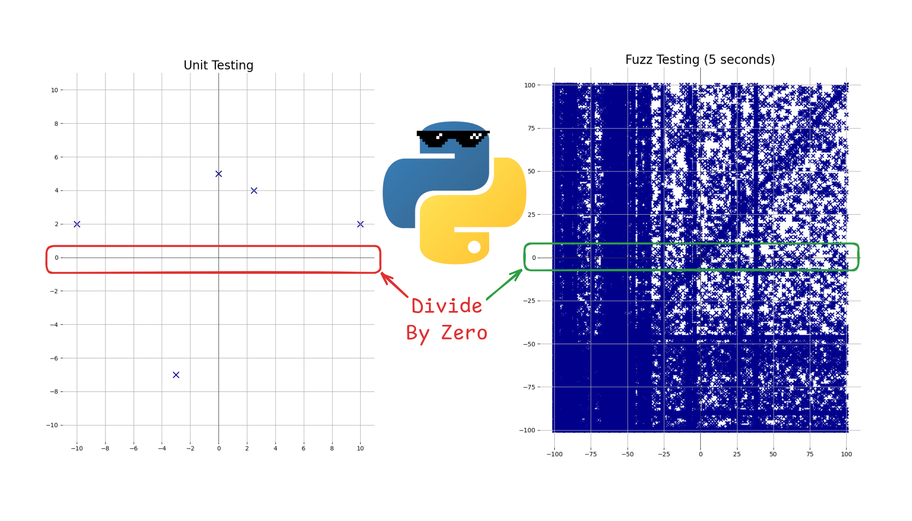

## Examples of Fuzzing Python Code

This repo contains folders that each corresponds to a blog post showing how
to use [Atheris](https://github.com/google/atheris) to fuzz Python code.

- [1-intro/](./1-intro/) -- [Post: Getting Started with Python Fuzzing Using Atheris](https://seeinglogic.com/posts/intro-to-atheris/)
- [2-fuzzing-for-correctness/](./2-fuzzing-for-correctness/) -- [Post: Fuzzing Python for Correctness: Checking on ChatGPT](https://seeinglogic.com/posts/checking-on-chatgpt/)

Tested on Ubuntu 22.04 with Python 3.10.12.

Hope this helps, please open an issue on the repo if you have any problems.
Check out the [blog](https://seeinglogic.com) for more, or stay up-to-date with me on [BlueSky](https://bsky.app/profile/seeinglogic.bsky.social).
